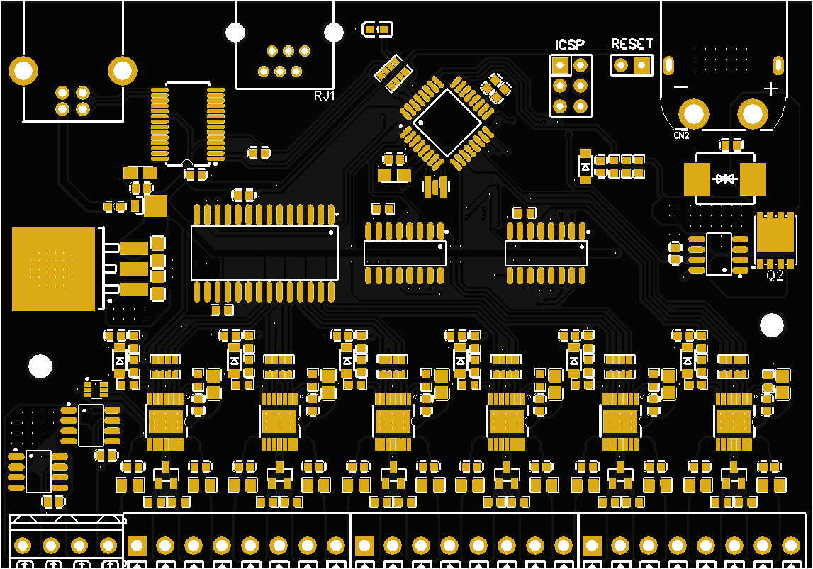

# BigPowerBox
 An open source power distribution switch for 12VDC applications

# Introduction
The BigPowerSwitch is a 12V DC distribution switch that allows individual control and measurement of 14 DC ports. It should be able to drive 30A of current to the output ports with a maximum of 6.5 amps on each port. It is not recommended to drive the board that high as the thermals have not been tested to that level. It should function correctly for the usual loads pulled by astronomy cameras and accessories.

# Implementation
The BigPowerSwitch has the following components:
- PCB
  - 4 layer 
    - top layer signal + GND flood
    - uninterrupted 1 Oz 12V flood ( do a 2Oz if you can. Also might be better to swap this one with plane 3 for future add of USB3.1 - impedance )
    - uninterrupted 1 Oz GND flood
    - bottom layer via signals + GND flood
- Input stage
  - XT60 connector for 30A capability, polarity protection and snug connection. Also pretty much the standard for RC stuff so I have good experience with and love those connectors. If it can survive sustaining multiple Gs followed by a crash while pulling 30Amps it should work for astro gear. I would have prefered a screwable connector but could not find a good option, also having a different polarized connector can prevent mistakes.
  - 33V TVS diode
  - 20V 60A Mosfet to protect against reverse voltage input ( backwards connection to a battery )
  - 30A Ammeter feeding a dedicated ADC port on the microcontroller ( In Amps )
  - 15V to 5V voltage divider feeding a dedicated ADC port in the microcontroller ( In Volts )
- Output stages
  - uses the 12V plane
  - 6 Infineon BTS7008-2EPA 2 channel high switches
    - 4 for switch ports ( 8 ports ) enable pins through port expander MCP23017
    - 2 for PWM control ( 4 ports ) enable pins directly driven by microcontroller digital PWM pins
    - diagnostic pin for Current sensing feeding a multiplexed ADC pin on the microcontroller
    - I chose Infineon as they seem to be an automotive supplier and thus heavier duty than my original thought of using TI backplane chips.
  - 2 10A Ammeters for always-on ports feeding a multiplexed ADC pin on the microcontroller. Here I used CrossChip, the LCSC part choser only gave this reference for a 10A ammeter, datasheet needed to be translated as not available in English...
  - 5V/1A voltage regulator for VCC
  - DB125 screw terminals
- Control
  - Arduino nano V3 implementation
    - Atmel 328P microcontroller
    - FT232RL USB serial controller
    - 1 power LED ( yep Tx and Rx leds are just luminous noise, even this one is overkill )
    - ICSP port
    - i2c bus with RJ12 output for temp/humid sensor
  - MCP23017 i2c I/O port expander
    - controls the enable pins of the on/off switches (EN0 and EN1 on BTS7008-2EPA)
    - uses the 8 GPA pins. 8 pins (GPB) unused
  - 2 74HC4051D multiplexers
    - one for output: distributes the DSEL signal to select the diagnosed port on the Infineon switches
    - one for input: collects the diagnostic signal from the Infineon switches and output port ammeters to a single ADC pin on the microcontroller
    - both function in parallel driven by the same 3 control pins on the microcontroller

All resistor and capacitor values were chosen based on datasheet recommendations and prototyping sample board specifications. I'm pretty sure I could have used more decoupling caps.

The board was designed in EasyEDA with the LCSC for JLCPCB parts catalog and fabricated by JLCPCB. This PCB prototyper has a minimum of 5 boards runs for PCB production and 2 boards for assembly, the run for 5 boards and 2 assemblies was less than 250USD delivered.

I have provided in this repo:
- the Gerber files to produce the PCB
- the EasyEDA source files with the schematics and PCB layout
- BoM file
- placement file for assembly

# PCB image and Finished product

