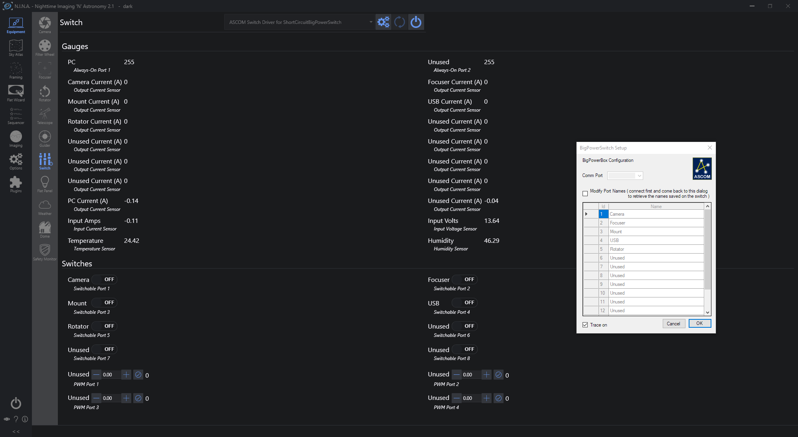

# BigPowerBox
 An open source power distribution switch for 12V DC applications
- [BigPowerBox](#bigpowerbox)
  - [Introduction](#introduction)
  - [File contents](#file-contents)
  - [Requirements](#requirements)
    - [Operate](#operate)
    - [Build](#build)
  - [PCB picture](#pcb-picture)
  - [Product renderings ( 3d printer still printing at time of this commit )](#product-renderings--3d-printer-still-printing-at-time-of-this-commit-)
  - [N.I.N.A Screencap](#nina-screencap)
- [Acknowledgements](#acknowledgements)

## Introduction
Astrophotography is great hobby but some of its drawbacks are that you often need to hang out in the cold and drive to far away places to find dark skies. Both of these problems can be solved with remote observing, either from your comfortable office while your telescope is out in the cold backyard or far away in a remote observatory. In both cases you may need to power-off-and-on-again equipment to reboot it or simply to shut down your observatory for the day. To this end you can buy specialized equipement to do so or build your own! 

But why would you build vs buy??? 

For one, specialized power boxes are usually expensive (400 to 1000 USD range) and may not provide the features you actually need. Secondly - and most importantly in my case - all the commercial offerings absolutely insist on providing the output ports on 2.5mm barrel connectors. These connectors' fit are notoriously unreliable and in the case of astronomy with a moving mount pulling and tugging on cables is a recipe for frustration and lost imaging time.
The *BigPowerBox* aka *PowerBox Exxxtreme* is built with versatility, reliability and scale in mind. The output connectors are all GX-12 aviation plugs, most high quality mounts on the market use these plugs as they *screw-on* and provide a very secure connection. A few years back, frustrated by disconnects during slews I replaced all the connectors ( including serial and USB ) with Gx-12s in my EQ-6, this was the origin of my love for these connectors.
I also found that the commercial powerboxes were also limited in ports, so I went overboard and crammed as much as I could in a small footprint. The box provides natively 14 12V output ports, you could customize these with small buck converters to 5V or whatever voltage mix you would want.

Building this box was also an exercise in learning a new hobby: electronics design. I'm a CS engineer, not EE. I have built a lot of Arduino based tools ( flip flat panel, temperature regulators for my cheap wine fridges, my own 3d printer and a slew of home automation devices ) but never a device that needed me to read datasheets for. So even though I tested the device I guarantee nothing and do not blame me if it burns down your stuff. I release this as Open Source Hardware with a CERN license so that real HW designers can improve on my base design and point out my noob mistakes. I had my boards fabricated by JLCPCB for about 100USD a piece.

This repo contains all the necessary files to build and control a power box with the following features

- 12V dc 30A input through an XT-60 port
- 14 power ports
  - 2 always-ON ports up to 10A each - use these to connect your NUC or other PC as well a s USB hub
  - 8 switchable ports up to 6.5A each - connect your cameras, mount, focusers, rotators, dust-caps, etc...
  - 4 PWM ports up to 6.5A each - dew-heaters, flat panels or add filtering caps if you want to make them adjustable voltage ports
- expansion RJ12 port for i2c accessories
  - currently only SHT31 Temperature/Humidity probe is supported
- reverse polarity protection on input and outputs
- overcurrent protection
- configurable overvoltage protection ( set in code at 14.4V )
- input Current and voltage measurement
- output current measurement on all ports
- TODO: dew heater control based on temp/humid sensors 

## File contents
Please read the Readme in each folder for more details

- Arduino
  - BigPowerBox   -  Arduino firmware
- Drivers
  - BigPowerSwitchServer  -  Visual Studio 22 solution to build the ascom COM server driver
  - IndiBigPowerSwitch - TODO: Indi driver
- Hardware
  - Enclosure - Case STL + link to Fusion 360 model
  - PCB - Gerber files to have the board manufactured, BOM and placement files, Electric schematics, EasyEDA project files

## Requirements
### Operate
To Operate this device you will need the following
- Windows
  - Ascom platform
  - FTDI driver ( my arduino implementation uses a FT232 chip)
  - Astro sequencer ( I tested on N.I.N.A but this should also work on SGP and others )
  - download the ascom installer from the releases tab and run it, the Switch will be available in your Ascom chooser under "ShortCircuit.BigPowerSwitch"
- Linux (TODO)
  - Indi platform
  - Kstars / Ekos

### Build
To build the device and customize it you will need:
- a spare arduino with an ICSP cable ( to burn the bootloader ). I used an arduino nano from which I cut the traces to the RESET pin on the ICSP header and soldered it to pin D10. Replaced the header with a set of pogo pins and done.
  - [Pogo pins](https://www.amazon.com/gp/product/B075Q25BK3)
  - [Arduino](https://www.amazon.com/gp/product/B0713XK923)
- Arduino dev environment
- for ASCOM the Ascom dev platform and Visual Studio 2022
- for Linux Indi and build-tools
- EasyEDA
- 3d printer + slicer
- [M3 8mm flat head bolts](https://www.amazon.com/gp/product/B07WZL3Z7H)
- [M3 inserts](https://www.amazon.com/gp/product/B08YYGRCBG)
- [GX12 connectors](https://www.amazon.com/gp/product/B01MPXOOI3)
- [SHT31](https://www.amazon.com/gp/product/B07ZSZW92J)
- [XT60 connectors](https://www.amazon.com/gp/product/B07Q2SJSZ1)

## PCB picture

## Product renderings ( 3d printer still printing at time of this commit )

## N.I.N.A Screencap

# Acknowledgements
The first electronic project I built and customized was [MyfocuserPro2](https://sourceforge.net/projects/arduinoascomfocuserpro2diy/) by [Robert Brown](rbb1brown@gmail.com), reading and customizing the code for my version of the focuser introduced me to Arduino programming and pushed me to build my 3d printer. I encourage you to go check that project out.